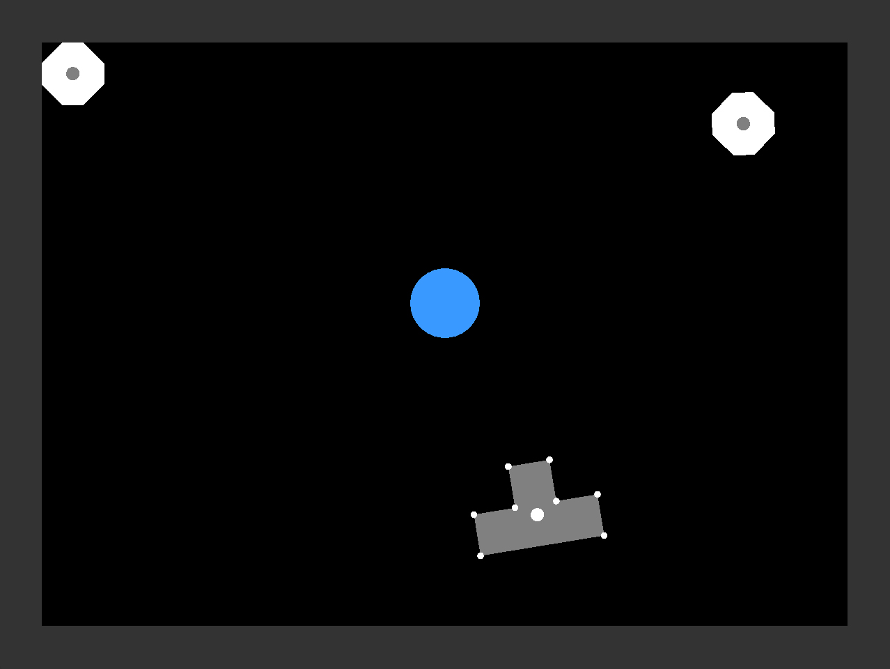
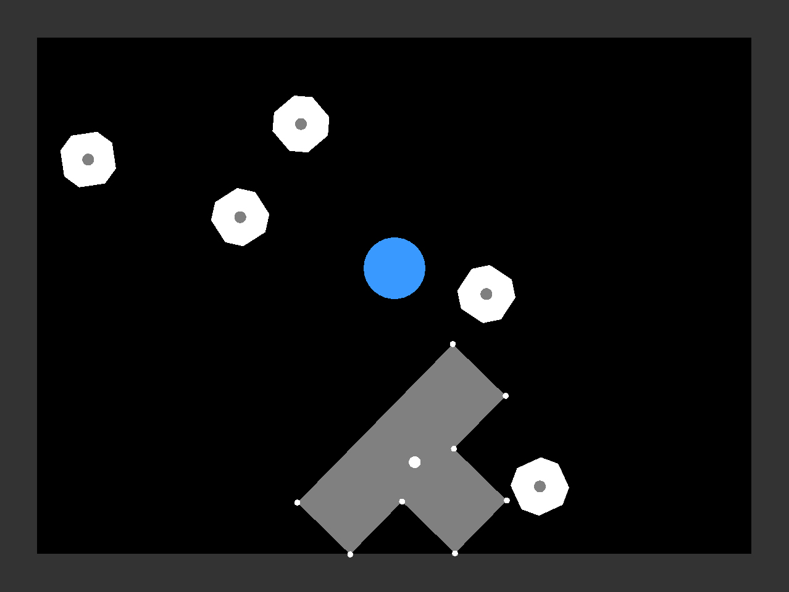
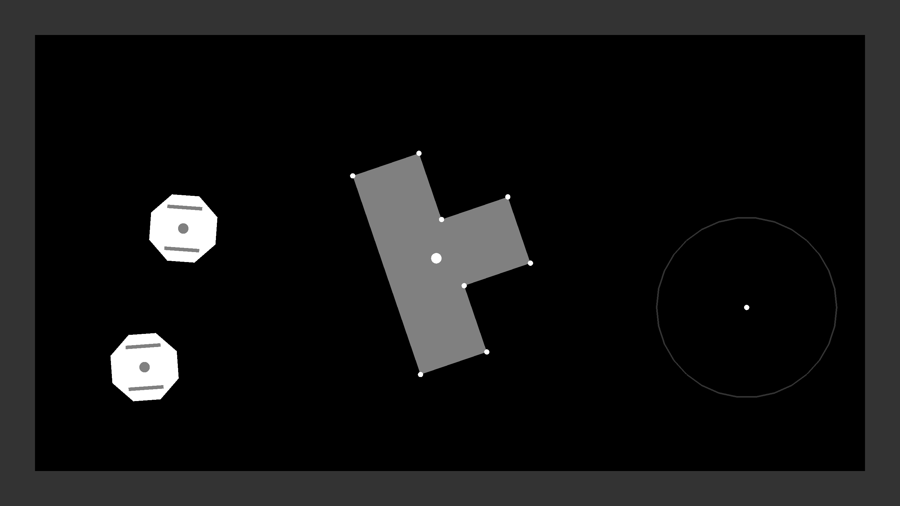
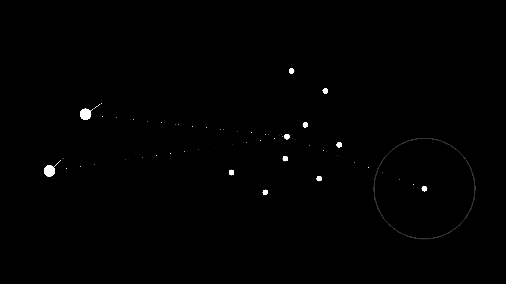

# OpenAI Gym Puzzles

This repository contains custom OpenAI Gym environments using PyBox2D. Each environment contains multiple robots which are centrally controlled by a single agent, whose goal is to move the T-shaped block to the goal location, marked by a blue circle. For true mutli-agent environments check out [multiagent-env](https://github.com/khajash/multiagent-env).

**Note:** These envs were developed in 2018. I have made minor updates to be compatible with `gym==0.21`, but updating the code to be more modular and easy to configure is in progress.

## Setup

```
git clone https://github.com/khajash/gym_puzzles.git
cd gym_puzzles
python -m venv .env
source .env/bin/activate
pip install -e .
```

## Usage

```
import gym_puzzles
env = gym.make('MultiRobotPuzzle-v0')
```

## Envs Available

This is a 2-D environment in which multiple octagonal robots (with either holonomic or non-holonomic control) move blocks to a specified location demarcated by a blue circle. In this current version, there is only a single block initialized, but it has the capabilites of initializing with 3 blocks to form a square.

There are four envs currently configured:
-  **Holonomic Control**
    - `MultiRobotPuzzle-v0`
    - `MultiRobotPuzzleHeavy-v0`
- **Non-Holonomic Control**
    - `MultiRobotPuzzle-v2`
    - `MultiRobotPuzzleHeavy-v2`


#### `MultiRobotPuzzle-v0` and `MultiRobotPuzzleHeavy-v0`

In both of these environments, the robots have holonomic control, meaning they can move freely in the x and y-dimensions and rotate. 

**Actions:** 
- Continuous with shape `3*n` with `n` robots. 
- Each robot has control of linear velocity in x and y-dimensions and angular velocity

**Reward:**
- Between robot and block:
    - delta distance between prev timestep and cur timestep to encourage larger positive movements
    - negative reward based on distance between robot and block 
- Between block and goal:
    - delta distance between prev timestep and cur timestep to encourage larger positive movements
    - negative reward based on distance between block and goal 
- Reward for completing puzzle

**State:**
- For each robot: relative location to block, distance to block, contact with block
- For each block: relative location to goal, distance to goal, global position of block's vertices 

The base version `MultiRobotPuzzle-v0` contains 2 agents with a lighter and smaller block than the heavy version.




The heavy version `MultiRobotPuzzleHeavy-v0` contains 5 agents with a block that is 2x the size of the block in the normal environment and 2x heavier.




#### `MultiRobotPuzzle-v2` and `MultiRobotPuzzleHeavy-v2`

In both of these environments, the agents have non-holonomic control, where the robots control their linear velocity and turning radius, similar to a car. This robots' goal is to move the block to a specified location demarcated by a white circle with larger outline representing the margin of error. In this current version, there is only a single block initialized, but it has the capabilites of initializing with 3 blocks that form a square.

**Actions:** 
- Continuous with shape `2*n` with `n` robots. 
- Linear velocity and turning angle

**Reward:** 
- Between robot and block:
    - delta distance between prev timestep and cur timestep to encourage larger positive movements
    - negative reward based on distance between robot and block 
- Between block and goal:
    - delta distance between prev timestep and cur timestep to encourage larger positive movements
    - negative reward based on distance between block and goal 
- Reward for completing puzzle that decays over time encouraging faster completion of task

**State:** 
- For each robot: relative location to block, distance to block, contact with block
- For each block: relative location to goal, distance to goal, global position of block's vertices 

Both the base and heavy versions have the same size block, but the heavy version has a density significantly higher making it very difficult to move alone. This image below shows the standard human vision rendering style showing solid fills for objects, vertices, and centroids.



***Rendering Agent Vision***

This rendering style is meant to give us an idea of what the agent sees. It only shows centroids, vertices, and vectors. 




## Hyperparameter Tuning with Weights and Biases's Sweep
1. Go to WandB project on web console. If you don't have a project already, create a new one.
2. Select Sweeps > Create Sweep
3. Copy yaml config sweep from `sweep-bayes.yml` or write custom one. The autogenerated yaml is not helpful for my setup. Press `Initialize Sweep`
4. Make sure default params in `parsers.py` are correct and it's referencing the correct config file (TODO: check if can specify cmdline params)
5. Set `RUN_WANDB_SWEEP = True` at beginning of `train.py` file. This allows wandb to override hparams in the sweep, otherwise it will keep the default configuration.
6. In the WandB sweep console, copy launch agent `wandb agent user/project/agentID` and run in an open terminal. This will start your sweep. Do this on as many separate machines as you want for distrubuted tuning.